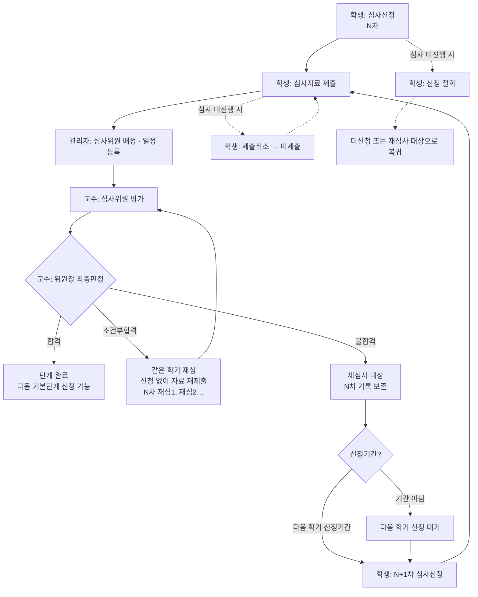

# 심사 신청 ~ 재심사 프로세스 (목업 기준)

- 작성일: 2026-10-06
- 기준: `feature/re-review-mockup` 브랜치의 목업 구현 (학생 `452cde0` / 교수 `4200bbd` / 관리자 `ffa67ba`)
- 관련 문서: `재심사_제출취소_영향도분석_20261006.md` 0장 (확정 사양)
- 범위: 기본단계(논문작성계획서 → 예비심사 → 본심사) 하나의 심사 사이클과 그 결과에 따른 재심 / 재심사

---

## 1. 용어

| 용어 | 의미 | 화면 표기 |
|---|---|---|
| 차수 | **불합격** 시 다음 학기에 심사신청부터 다시 진행할 때 증가 | `1차`, `2차` … |
| 재심 | **조건부합격** 시 같은 학기·같은 차수 안에서 자료만 재제출 | `1차 재심1`, `1차 재심2` … |
| 신청 철회 | 심사신청 자체를 취소 | 학생 심사신청 [철회] |
| 제출취소 | 제출한 심사자료(파일)만 삭제. 신청은 유지 | 학생 자료제출 [제출취소] |
| 심사 진행 | 심사위원 1명 이상이 평가를 저장한 상태 | 결과 칸 `심사중` |

---

## 2. 전체 흐름

> 점선: 진행 중 취소 경로. 심사위원 배정·일정 등록 단계는 이번 목업에서 변경하지 않음(기존 화면 그대로).

---

## 3. 단계별 상세

### 3-1. 심사신청 — 학생 `단계별 심사신청`

| 조건 | 신청상태 | 차수 | 관리 버튼 |
|---|---|---|---|
| 이전 기본단계 미합격 | 선행단계 미완료 | - | - |
| 신청 이력 없음 + 신청기간 | 미신청 | - | **[신청]** |
| 신청 이력 없음 + 기간 아님 | 미신청 | - | 신청기간 아님 |
| 신청 완료, 평가 0명 | 신청완료 | N차 | **[철회]** |
| 신청 완료, 평가 1명 이상 | 심사중 | N차 | [철회] → 불가 안내 |
| 조건부합격 후 재심 진행 | 조건부합격(재심) | N차 | 재심 자료는 심사자료제출에서 제출 |
| **불합격 확정 + 신청기간** | **재심사 대상** | N+1차 (N차 불합격) | **[N+1차 신청]** |
| **불합격 확정 + 기간 아님** | **재심사 대상** | N+1차 (N차 불합격) | 다음 학기(학기명) 신청 |
| 합격 | 합격 | N차 | - |

- N+1차 신청 모달에 안내 표시: "N차 심사 불합격으로 N+1차 재심사를 신청합니다. 이전 차수의 제출 자료와 심사 결과는 이력으로 보존됩니다."
- 신청하면 해당 차수의 제출 행이 자료제출 화면에 생성됨(입력한 논문 제목이 기본값).

### 3-2. 심사자료 제출 — 학생 `단계별 심사자료제출`

| 상태 | 제출구분 | 제출상태 | 심사결과 | 관리 버튼 |
|---|---|---|---|---|
| 신청 후 미제출 | N차 | 미제출 | - | **[제출]** |
| 제출, 평가 0명 | N차 | 제출완료 | 심사 대기 | [보기] **[제출취소]** |
| 제출, 평가 1명 이상 | N차 | 제출완료 | 심사중 | [보기] [제출취소] 비활성 |
| 조건부합격 후 | N차 재심K | 재심 제출 대기 | - | **[재심 제출]** |
| 결과 확정 | N차 (재심K) | 제출완료 | 합격 / 조건부합격 / 불합격 | [보기] |

- 목록은 기본단계마다 **최신 기록 1행**. **기본단계명을 누르면 차수별 기록 팝업**이 열림(1차 → 1차 재심1 → 2차 …, 제출일시·파일·결과·위원장 총평). 기간과 상관없이 조회 가능.
- [수정]은 심사 미진행(평가 0명)이고 결과가 나오기 전일 때만 보임.

### 3-3. 심사위원 배정 · 일정 등록 — 관리자

- 이번 목업에서는 변경하지 않음. 교수 심사목록의 Mock은 배정이 완료된 상태로 구성.

### 3-4. 심사 · 최종판정 — 교수 `심사 관리`

| 화면 | 표시 / 동작 |
|---|---|
| 심사목록 | **차수** 컬럼(`1차`, `2차`). **심사결과**: 판정 전은 대기 / 진행 중 / 심사완료, 판정 후는 합격 / 조건부합격(재심N 진행) / 불합격(다음 학기 재신청) |
| 재심사 건 상세 | 상단에 **이전 차수 이력**: 차수, 학기, 제출일, 결과, 판정일, 위원장 총평 |
| 판정: 합격 | 결과 저장 → 상태 '합격' |
| 판정: 조건부합격 | 재심 위원(위원회 전체 또는 특정 위원 1명)과 평가표 선택 → 저장 → **재심 회차 +1** (재심1, 재심2 … 반복 가능) |
| 판정: 불합격 | 안내 표시: "불합격 확정 시 학생은 다음 학기에 심사 신청부터 다시 진행합니다. 기존 심사 내역은 N차 이력으로 보존됩니다." → 제출 시 확인창 → 결과 '불합격' |

### 3-5. 조회 — 관리자

| 화면 | 표시 |
|---|---|
| 논문신청 관리 | **차수** 컬럼, 신청상태 신청완료 / 미신청 / **철회** / **재심사 대상**(필터 포함). 상세에 차수·불합격 메모·철회일 |
| 학위논문 심사 조회 | **차수** 컬럼, 교수 목록과 같은 심사결과 표시 |

---

## 4. 판정 결과별 경로

| 판정 | 학기 | 심사신청 | 자료제출 | 표기 | 이전 기록 |
|---|---|---|---|---|---|
| 합격 | - | 다음 기본단계 신청 가능 | - | N차 합격 | 보존 |
| 조건부합격 | **같은 학기** | **필요 없음** | 재심 자료 제출 → 지정 위원 재심 | `N차 재심K` (반복 가능) | 원 제출본은 '기존 제출 내역'으로 보존 |
| 불합격 | **다음 학기** | **N+1차로 다시 신청** | 새로 제출 | `N+1차` | N차 기록(파일·결과·총평) 보존, 언제든 조회 |

- 이전 기본단계 결과는 영향 없음 (예: 본심사 불합격이어도 계획서·예비심사 합격 유지).
- 횟수 제한 없음.

---

## 5. 취소 규칙

| 구분 | 위치 | 가능 조건 | 불가 시 | 결과 |
|---|---|---|---|---|
| 신청 철회 | 학생 심사신청 [철회] | 결과 확정 전 + 평가 0명 | "심사가 진행중이므로 철회할 수 없습니다." | 확인창: "해당 단계에서 제출한 자료와 내역은 모두 초기화됩니다(합격여부가 결정된 단계 제외) 그래도 철회하시겠습니까?" → 신청은 '철회'로 기록, **결과가 없는** 해당 차수 제출자료 삭제, 확정된 이전 차수 기록은 보존 → 미신청 또는 재심사 대상으로 복귀 |
| 제출취소 | 학생 자료제출 [제출취소] | 제출완료 + 결과 확정 전 + 평가 0명 | 버튼 비활성 + 안내 "심사가 진행 중이어서 제출을 취소할 수 없습니다." | 제출 파일 삭제 → 미제출(재심이면 '재심 제출 대기'), 신청은 유지 |

- 제출취소 **기간** 조건은 정책이 정해지지 않아 이번 목업에서는 적용하지 않음.

---

## 6. 시연 방법

| 화면 | 진입 | 시연 데이터 |
|---|---|---|
| 학생 | `student-v3/student-dashboard.html` → 단계별 심사신청 / 심사자료제출 | 상단 **목업 시연 바**에서 시나리오 ①~⑤ 선택, [초기화]로 원상 복구 |
| 교수 | `professor-v3/professor-dashboard-proposal.html` → 심사 관리 | 홍길동 예비심사 1차(불합격) · 2차(진행중), 재심테스트(위원장 판정 대기) |
| 관리자 | `admin-v3/index.html` → 논문신청 / 학위논문심사 | 김철수 예비심사 1차 재심사 대상 · 2차 신청완료, 이영희 철회 |

| 시나리오 | 보여주는 것 |
|---|---|
| ① 재신청 가능 | 예비심사 1차 불합격 → [2차 신청] → 자료제출에 2차 행 생성, 단계명 클릭 시 1차 기록 |
| ② 다음 학기 대기 | 신청기간이 아니어서 "다음 학기(2027-1학기) 신청" 안내 |
| ③ 심사 미진행 | [철회] 초기화 안내 / [제출취소] 가능 |
| ④ 심사 진행 중 | [철회] 불가 팝업 / [제출취소] 비활성 |
| ⑤ 조건부 재심 | 본심사 1차 조건부합격 → 신청 없이 [재심 제출], `1차 재심1` 표기 |

---

## 7. 목업의 한계 (실제 구현 시 고려)

1. **화면 간 연동 없음** — 교수가 불합격을 판정해도 학생 화면은 바뀌지 않음(각 화면은 자체 Mock 사용). 학생은 시나리오 바로 상태를 재현.
2. **심사위원 배정·일정 등록**은 변경하지 않음 — 철회·제출취소 시 배정 삭제, N+1차 배정 생성은 표현되지 않음.
3. **제출취소 기간**은 정책 미정으로 미적용 — 관리자 일정 설정 화면 추가 필요.
4. **신청기간 판정**은 Mock 값(열림/닫힘)으로 고정 — 실제 날짜 비교 아님.
5. 지도교수 변경 시 새 차수에 변경된 지도교수를 반영하는 부분은 표현하지 않음.
