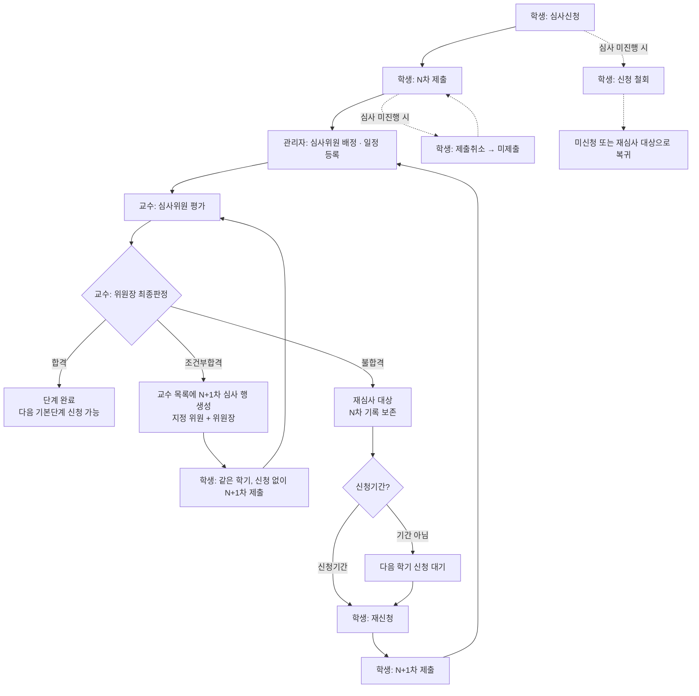

# 심사 신청 ~ 재심사 프로세스 (목업 기준)

- 작성일: 2026-10-06 / 개정: 2026-10-07 (번호 체계 변경, 추가 화면 반영, 검토 보완 v3.1)
- 기준: `feature/re-review-mockup` 브랜치의 목업 구현
- 관련 문서: `재심사_제출취소_영향도분석_20261006.md` 0장(확정 사양) · 0-5(추가 수정 범위)
- 범위: 기본단계(논문작성계획서 → 예비심사 → 본심사) 하나의 심사 사이클과 그 결과에 따른 보완 심사 / 재신청

---

## 1. 용어

| 용어 | 의미 | 화면 표기 |
|---|---|---|
| 제출 번호(차수) | 기본단계 안에서 **제출·심사할 때마다 1씩 증가**. 조건부합격 후 보완 제출, 불합격 후 재신청 제출 모두 포함 | 학생 `1차 제출`, `2차 제출` … / 교수·관리자 `1차`, `2차` … |
| 재신청 | 불합격 후 다음 학기에 심사신청부터 다시 하는 것 | 학생 심사신청 [재신청], 관리자 신청구분 '재신청' |
| 보완 제출 | 조건부합격 후 같은 학기에 신청 없이 자료만 다시 제출하는 것. **화면에 '재심'이라고 따로 표시하지 않고 일반 제출·심사 1건으로 다룸** | 다음 번호의 `N차 제출` |
| 신청 철회 | 심사신청 자체를 취소 | 학생 심사신청 [철회] |
| 제출취소 | 제출한 심사자료(파일)만 삭제. 신청은 유지 | 학생 자료제출 [제출취소] |
| 심사 진행 | 심사위원 1명 이상이 평가를 저장한 상태 | 결과 칸 `심사중` |

---

## 2. 전체 흐름

> 점선: 진행 중 취소 경로.

**예시 (예비심사)**

| 순서 | 학생 행동 | 제출 번호 | 판정 | 다음 |
|---|---|---|---|---|
| 1 | 2026-1학기 신청 → 제출 | 1차 제출 | 조건부합격 | 같은 학기 보완 제출 |
| 2 | 신청 없이 보완 제출 | 2차 제출 | 불합격 | 다음 학기 재신청 |
| 3 | 2026-2학기 재신청 → 제출 | 3차 제출 | 합격 | 본심사 신청 가능 |

---

## 3. 단계별 상세

### 3-1. 심사신청 — 학생 `논문 심사 > 논문신청`

| 조건 | 신청상태 | 관리 버튼 |
|---|---|---|
| 이전 기본단계 미합격 | 선행단계 미완료 | - |
| 신청 이력 없음 + 신청기간 | 미신청 | **[신청]** |
| 신청 이력 없음 + 기간 아님 | 미신청 | 신청기간 아님 |
| 신청 완료, 평가 0명 | 신청완료 | **[철회]** |
| 신청 완료, 평가 1명 이상 | 심사중 | [철회] → 불가 안내 |
| 조건부합격 후 보완 진행 | 조건부합격 | 보완 자료는 심사자료제출에서 제출 |
| **불합격 확정 + 신청기간** | **재심사 대상** | **[재신청]** |
| **불합격 확정 + 기간 아님** | **재심사 대상** | 다음 학기(학기명) 신청 |
| 합격 | 합격 | - |

- 심사신청 화면에는 번호를 표시하지 않습니다.
- 재신청 모달 안내: "불합격 판정에 따라 재신청합니다. 이전 제출 자료와 심사 결과는 이력으로 보존됩니다."
- 신청하면 자료제출 화면에 다음 번호의 제출 행이 생깁니다(입력한 논문 제목이 기본값).

### 3-2. 심사자료 제출 — 학생 `논문 심사 > 학위논문제출`

| 상태 | 제출구분 | 제출상태 | 심사결과 | 관리 버튼 |
|---|---|---|---|---|
| 신청 후 미제출 | N차 제출 | 미제출 | - | **[제출]** |
| 제출, 평가 0명 | N차 제출 | 제출완료 | 심사 대기 | [보기] **[제출취소]** |
| 제출, 평가 1명 이상 | N차 제출 | 제출완료 | 심사중 | [보기] [제출취소] 비활성 |
| 조건부합격 후 | N+1차 제출 | 미제출 | - | **[제출]** — 제출 화면에 직전 제출 내역(조건부합격·총평) 함께 표시 |
| 결과 확정 | N차 제출 | 제출완료 | 합격 / 조건부합격 / 불합격 | [보기] |

- 목록은 기본단계마다 **최신 제출 1행**입니다. **기본단계명을 누르면 '제출 기록' 팝업**이 열립니다. 1차 제출부터 시간순으로 제출일시, 파일, 결과, 위원장 총평이 나오고, 기간과 상관없이 볼 수 있습니다.
- [수정]은 심사가 진행되지 않았고(평가 0명) 결과가 나오기 전일 때만 보입니다.
- 불합격 행의 심사결과 아래에 '논문신청에서 재신청' 안내가 표시됩니다.
- 제출 폼의 논문 제목은 심사신청 때 입력한 제목(보완 제출이면 직전 제출 제목)이 기본값으로 채워집니다.

### 3-3. 심사위원 배정 — 관리자 `심사위원등록`

| 표시 | 내용 |
|---|---|
| 차수 컬럼 | 같은 학생·같은 기본단계 안의 심사 번호 (`1차`, `2차`) |
| 배정상태 | 배정 대기 / 배정 완료 / **배정 불가**(사유: 신청 철회 등) — 배정 불가 건은 [배정] 버튼 비활성 |

### 3-4. 심사일정 — 관리자·교수·학생 `심사일정현황`

- 세 화면 모두 **차수** 컬럼을 표시합니다. 학생 화면은 로그인 학생(홍길동)의 예비심사 1차(등록 완료)·2차(미등록) 일정이 나옵니다.
- 교수 화면에서 '세부단계' 칸이 빠져 열이 한 칸씩 밀리던 버그, 학위과정이 '석박통합'(목록)·'박사'(상세)로 잘못 나오던 버그, 대학구분·학적상태 필터가 0건이 되던 문제를 고쳤습니다.
- 관리자·교수 화면은 학년도·학기 필터의 기본값이 2025·1학기입니다. 2026학년도 시연 데이터(홍길동)를 보려면 학년도 '2026' 또는 '전체', 학기 '전체'를 선택하세요. (관리자 논문신청·심사위원등록, 교수·관리자 학위논문심사 필터에도 2026 추가)

### 3-5. 심사 · 최종판정 — 교수 `논문 심사 > 학위논문심사`

| 화면 | 표시 / 동작 |
|---|---|
| 심사목록 | **차수** 컬럼. **심사결과**: 판정 전은 대기 / 진행 중 / 심사완료, 판정 후는 합격 / 조건부합격 / 불합격(다음 학기 재신청) |
| 2차 이후 건 상세 | 상단에 **이전 차수 이력**: 차수, 학기, 제출일, 결과, 판정일, 위원장 총평. 1차 위원 평가(2건)도 보존되어 위원장 화면에서 조회 |
| 판정: 합격 | 결과 저장 |
| 판정: 조건부합격 | 보완 심사 위원(위원회 전체 또는 특정 위원 1명)과 평가표 선택 → 저장 → **목록에 다음 번호 심사 행 생성**(위원장 + 지정 위원, 학생 제출 전 '대기') |
| 판정: 불합격 | 안내: "불합격 확정 시 학생은 다음 학기에 심사 신청부터 다시 진행합니다. 기존 심사 내역은 N차 이력으로 보존됩니다." → 확인창 → 결과 '불합격'. 새 행은 학생이 재신청한 뒤 배정됨 |

### 3-6. 조회 — 관리자

| 화면 | 표시 |
|---|---|
| 논문신청 관리 | **신청구분**(최초 / 재신청), 신청상태 신청완료 / 미신청 / **철회** / **재심사 대상**(필터 포함) |
| 학위논문 심사 조회 | **차수** 컬럼, 교수 목록과 같은 심사결과 |

### 3-7. 대시보드

| 화면 | 표시 |
|---|---|
| 학생 | 단계 진행 배지가 **시연 시나리오를 따름**: 불합격 후 재신청 전 **'재심사 대상'**, 재신청 후 진행 중 **'재심사 진행'** |
| 교수 | '내 지도학생 현황' 카드에 **'재심사 N명'** (고정값) |
| 관리자 | '심사위원 등록 대기' · '심사일정 확정 대기' 표에 **차수** |

---

## 4. 판정 결과별 경로

| 판정 | 학기 | 심사신청 | 다음 제출 | 교수 목록 | 이전 기록 |
|---|---|---|---|---|---|
| 합격 | - | 다음 기본단계 신청 가능 | - | - | 보존 |
| 조건부합격 | **같은 학기** | **필요 없음** | N+1차 제출 (몇 번이든 반복 가능) | 판정 즉시 N+1차 행 생성 | 보존, 제출 화면에 직전 내역 표시 |
| 불합격 | **다음 학기** | **[재신청]** | N+1차 제출 | 재신청·배정 후 N+1차 행 | 보존, 언제든 조회 |

- 다음 기본단계는 해당 단계에서 **합격**해야 신청할 수 있습니다(조건부합격 상태에서는 불가).
- 이전 기본단계 결과는 영향 없음. 횟수 제한 없음.

---

## 5. 취소 규칙

| 구분 | 위치 | 가능 조건 | 불가 시 | 결과 |
|---|---|---|---|---|
| 신청 철회 | 학생 심사신청 [철회] | 결과 확정 전 + 평가 0명 | "심사가 진행중이므로 철회할 수 없습니다." | 확인창: "해당 단계에서 제출한 자료와 내역은 모두 초기화됩니다(합격여부가 결정된 단계 제외) 그래도 철회하시겠습니까?" → 신청은 '철회'로 기록, **결과가 없는** 제출 자료 삭제, 확정된 이전 기록은 보존 → 미신청 또는 재심사 대상으로 복귀 |
| 제출취소 | 학생 자료제출 [제출취소] | 제출완료 + 결과 확정 전 + 평가 0명 | 버튼 비활성 + "심사가 진행 중이어서 제출을 취소할 수 없습니다." | 제출 파일 삭제 → 미제출, 신청은 유지 |

- 제출취소 **기간** 조건은 정책이 정해지지 않아 이번 목업에서는 적용하지 않았습니다(질의 5-1).
- 관리자 심사위원 배정 화면은 철회된 건을 '배정 불가'로 보여 줍니다.

---

## 6. 시연 방법

| 화면 | 진입 | 시연 데이터 |
|---|---|---|
| 학생 | `student-v3/student-dashboard.html` → 논문신청 / 학위논문제출 / 심사일정현황 / 대시보드 | 상단 **목업 시연 바**에서 시나리오 ①~⑤ 선택, [초기화]로 처음 상태 복구 |
| 교수 | `professor-v3/professor-dashboard-proposal.html` → 학위논문심사 / 심사일정현황 / 대시보드 | 홍길동 예비심사 1차(불합격) · 2차(진행 중, 위원 1명 평가 — 학생 시나리오 ④와 대응), 판정테스트(위원장 판정 대기 — 조건부합격·불합격 판정 시연) |
| 관리자 | `admin-v3/index.html` → 논문신청 / 심사위원등록 / 심사일정현황 / 학위논문심사 / 대시보드 | 홍길동 예비심사 최초(재심사 대상) · 재신청, 이영희 철회(배정 불가) |

| 시나리오 | 보여주는 것 |
|---|---|
| ① 재신청 가능 | 예비심사 불합격 → [재신청] → 자료제출에 2차 제출 행 생성, 단계명 클릭 시 1차 제출 기록 |
| ② 다음 학기 대기 | 신청기간이 아니어서 "다음 학기(2027-1학기) 신청" 안내 |
| ③ 심사 미진행 | [철회] 초기화 안내 / [제출취소] 가능 |
| ④ 심사 진행 중 | [철회] 불가 팝업 / [제출취소] 비활성 |
| ⑤ 조건부합격 후 보완 제출 | 본심사 1차 제출 조건부합격 → 신청 없이 2차 제출 |

---

## 7. 목업의 한계 (실제 구현 시 고려)

1. **화면 간 연동 없음:** 교수가 판정해도 학생 화면은 바뀌지 않습니다. 각 화면이 자체 Mock을 쓰고, 학생 화면은 시나리오 바로 상태를 재현합니다. 시연 학생(홍길동)의 지도교수(박교수)·심사위원(이교수·박교수·정교수)·일자는 세 화면이 같습니다.
2. **철회·제출취소의 연쇄 처리:** 요구서(JXLB-2)는 철회 시 심사위원 배정 내역을 **삭제**하라고 하지만, 목업은 이력 확인용으로 관리자 심사위원등록에 '배정 불가'로 남겨 둡니다.
3. **제출취소 기간:** 정책이 정해지지 않아 적용하지 않았습니다. 관리자 일정 설정 화면을 추가해야 합니다.
4. **신청기간 판정:** 실제 날짜와 비교하지 않고 Mock 값(열림/닫힘)으로 고정했습니다.
5. **지도교수 변경:** 새 차수에 바뀐 지도교수를 반영하는 부분은 표현하지 않았습니다.
6. **교수 대시보드:** '재심사 N명'은 고정값입니다. 두 스크립트가 같은 영역을 덮어 그리는 기존 구조는 그대로 두었습니다.
7. **의도적으로 유지한 표기:** 교수 판정 화면의 '재심 정보 / 재심 심사위원' 문구, 공지 "재심사: 1회에 한해 무료 재심사 가능"(횟수 제한 없음 정책과 다름)은 바꾸지 않았습니다.
8. **백엔드 최소화 방향:** 조건부합격 후 보완 심사와 불합격 후 재신청 심사를 모두 "심사 1회 = 배정 1건(차수 포함)"으로 처리합니다. 배정 테이블에 차수와 원 배정 ID만 추가하면 되고, 평가·결과 구조는 바꾸지 않아도 됩니다.
