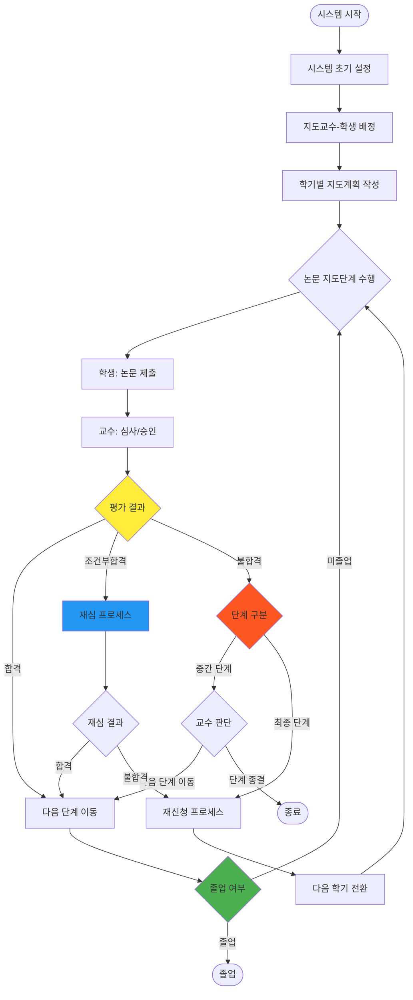
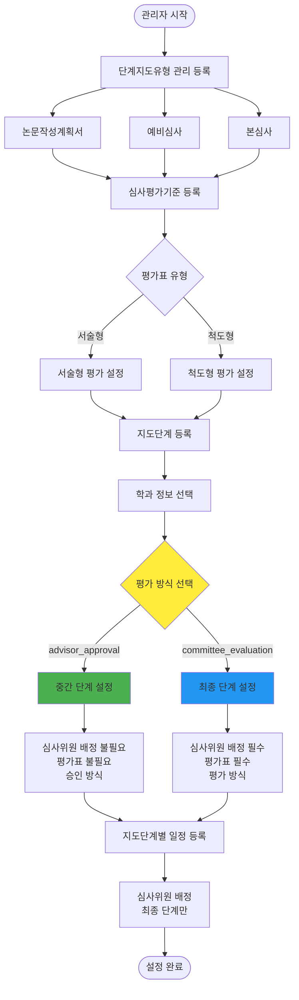
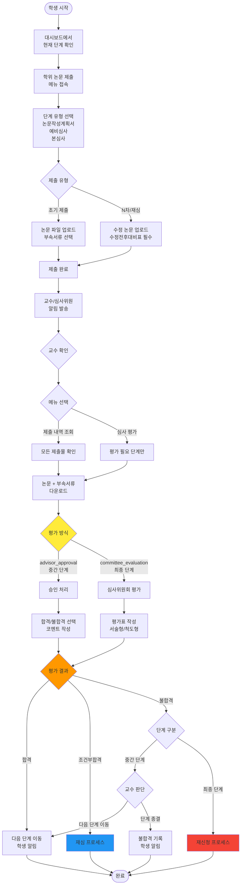
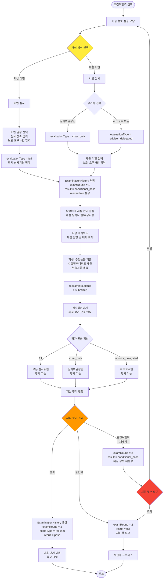
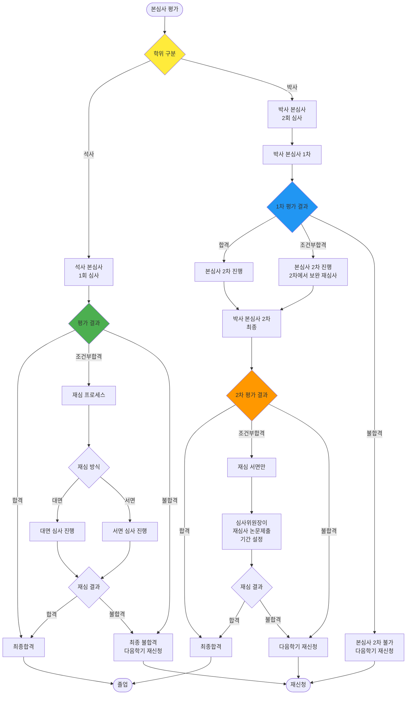
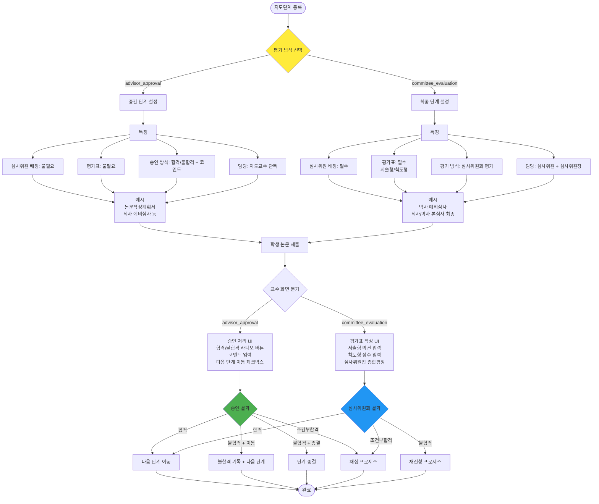
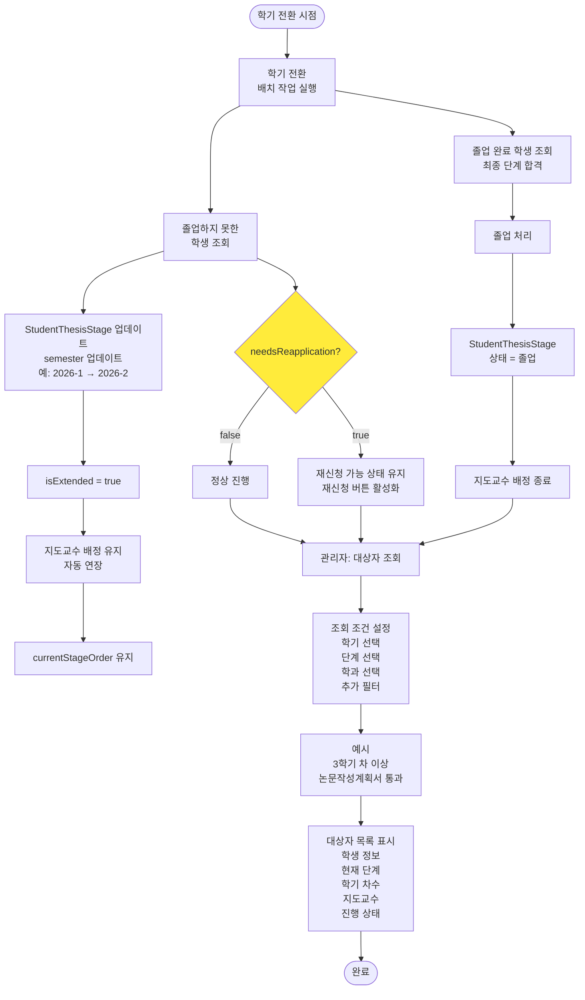
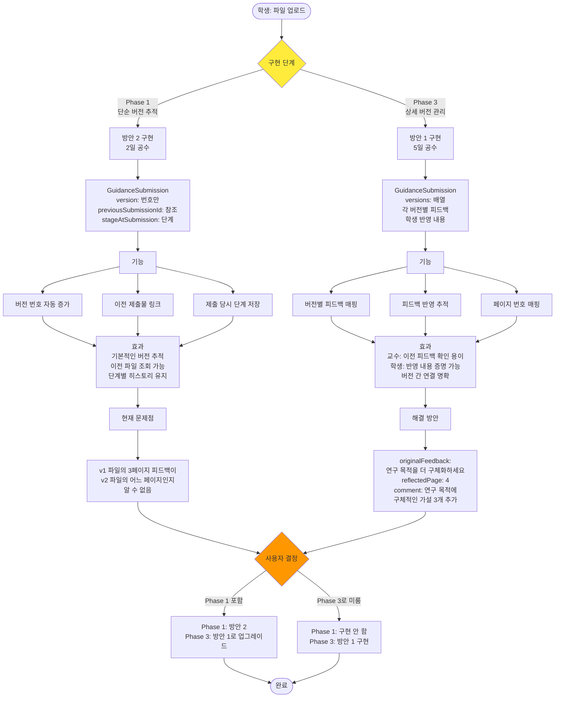
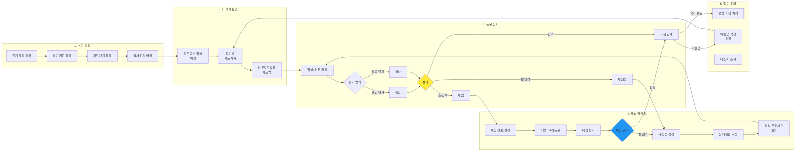

# 논문지도시스템 순서도 (Mermaid)

**작성일:** 2026.01.26
**목적:** Mermaid를 사용한 시스템 순서도 작성

---

## 사용 방법

1. **GitHub/GitLab**: `.md` 파일에 코드 블록으로 삽입하면 자동 렌더링
2. **VS Code**: Mermaid Preview 확장 설치 후 미리보기
3. **Notion**: Mermaid 블록으로 삽입
4. **온라인 에디터**: https://mermaid.live 에서 편집

---

# 1. 전체 시스템 개요



---

# 2. 시스템 초기 설정 프로세스



---

# 3. 논문 지도단계 수행 - 핵심 프로세스



---

# 4. 조건부합격 및 재심 프로세스 (상세)



---

# 5. 재신청 프로세스

```mermaid
flowchart TD
    Start([최종 불합격]) --> UpdateStudent[StudentThesisStage 업데이트<br/>needsReapplication = true<br/>canProceed = false]

    UpdateStudent --> NotifyFail[학생에게 불합격 알림<br/>불합격 사유<br/>재신청 안내<br/>재신청 가능 학기]

    NotifyFail --> Dashboard[학생 대시보드<br/>불합격 안내 영역 표시<br/>재신청 버튼 표시]

    Dashboard --> WaitSemester[다음 학기 전환 대기]

    WaitSemester --> Batch[학기 전환 배치 작업<br/>semester 업데이트<br/>isExtended = true]

    Batch --> ClickButton[학생: 재신청 버튼 클릭]

    ClickButton --> ValidateAuth{재신청 자격 검증}
    ValidateAuth -->|자격 없음| Reject[재신청 불가 안내]
    ValidateAuth -->|자격 있음| ApplicationForm[재신청 신청서 화면]

    ApplicationForm --> FillForm[신청서 작성<br/>논문 제목<br/>논문 초록<br/>키워드<br/>이전 신청 정보 표시]

    FillForm --> SubmitApp[제출]

    SubmitApp --> CreateApp[ThesisApplication 생성<br/>isReapplication = true<br/>previousApplications<br/>status = application_submitted]

    CreateApp --> RestoreStudent[StudentThesisStage 복구<br/>canProceed = true<br/>needsReapplication = false]

    RestoreStudent --> NotifyAdmin[관리자에게<br/>재신청 접수 알림]

    NotifyAdmin --> ShowProgress[학생: 재신청 진행 상황<br/>5단계 프로그레스바<br/>1.신청✅ 2.위원구성 3.논문제출<br/>4.심사 5.결과]

    ShowProgress --> AdminList[관리자: 재신청 건 목록]

    AdminList --> SelectApp[재신청 건 선택]

    SelectApp --> ViewDetail[재신청 건 상세 확인<br/>학생 정보<br/>논문 정보<br/>이전 신청 정보<br/>이전 불합격 사유]

    ViewDetail --> AssignCommittee[심사위원 구성]

    AssignCommittee --> ReuseOption{기존 구성 재사용?}
    ReuseOption -->|예| LoadPrevious[이전 구성 불러오기<br/>일부 변경 가능]
    ReuseOption -->|아니오| NewCommittee[신규 구성<br/>심사위원장 필수<br/>심사위원 선택]

    LoadPrevious & NewCommittee --> SaveCommittee[ThesisApplication 업데이트<br/>committeeChair<br/>committeeMembers<br/>status = committee_assigned]

    SaveCommittee --> NotifyStudent[학생에게<br/>심사위원 구성 완료 알림<br/>논문 제출 안내]

    NotifyStudent --> UpdateProgress[학생: 진행 상황 업데이트<br/>2.심사위원 구성✅]

    UpdateProgress --> ReturnNormal[정상 심사 프로세스로 복귀<br/>논문 제출부터 진행]

    ReturnNormal --> End([완료])
    Reject --> End

    style ValidateAuth fill:#ffeb3b
    style ReuseOption fill:#2196f3
```



---

# 6. 석사 vs 박사 재심 프로세스 비교



---

# 7. 평가 방식 분기 (evaluationType)



---

# 8. 학기 전환 및 대상자 관리



---

# 9. 파일 버전 관리 (Phase 1 vs Phase 3)



---

# 10. 시스템 통합 순서도 (간략)



---

# 사용 팁

## 1. 색상 변경
```mermaid
style 노드ID fill:#색상코드
```

## 2. 노드 모양
- `[]`: 사각형
- `()`: 둥근 사각형
- `([])`: 스타디움 (시작/종료)
- `{}`: 마름모 (분기)
- `[()]`: 실린더
- `[[]]`: 서브루틴

## 3. 화살표
- `-->`: 실선
- `-.->`: 점선
- `==>`: 굵은 선
- `-->|텍스트|`: 화살표에 텍스트

## 4. 서브그래프
```mermaid
subgraph "제목"
    노드들...
end
```

## 5. 방향
- `flowchart TD`: 위에서 아래 (Top Down)
- `flowchart LR`: 왼쪽에서 오른쪽 (Left Right)
- `flowchart RL`: 오른쪽에서 왼쪽
- `flowchart BT`: 아래에서 위

---

# 추가 작업 필요 시

위의 9개 순서도를 조합하여:
1. **전체 시스템 통합 순서도** (대형)
2. **역할별 순서도** (학생/교수/관리자)
3. **기능별 상세 순서도** (각 메뉴별)

를 작성할 수 있습니다.
